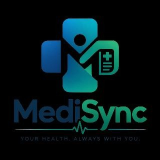
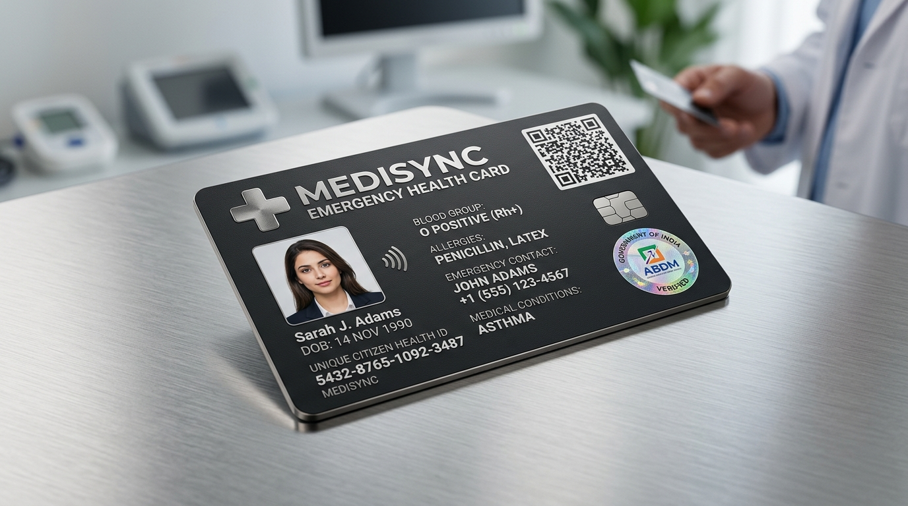
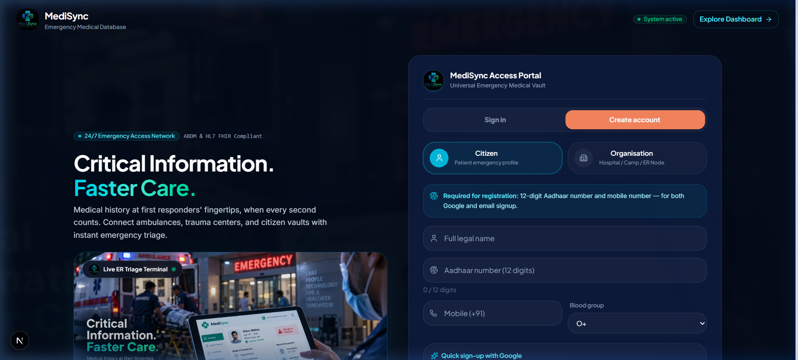
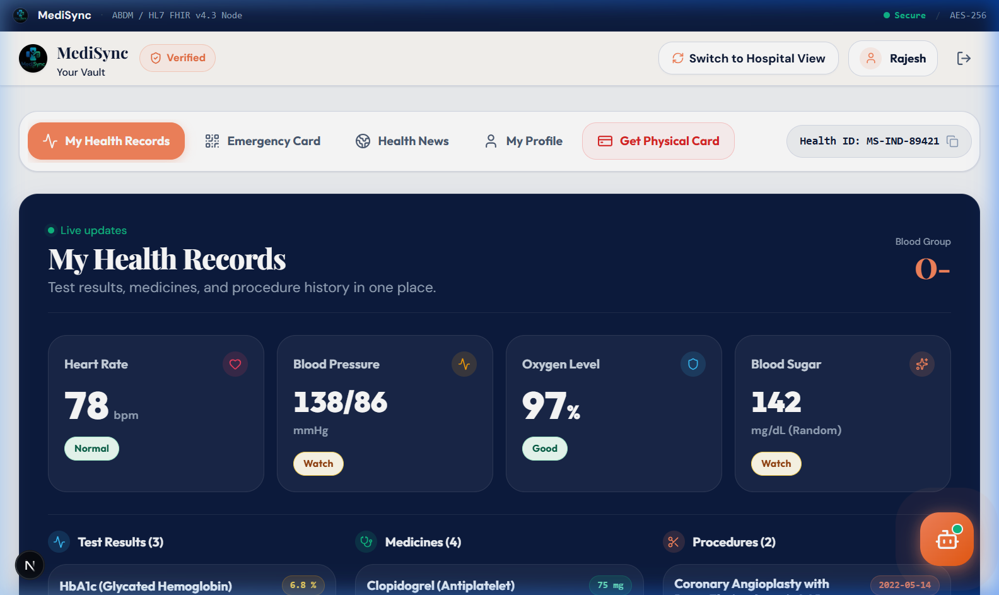
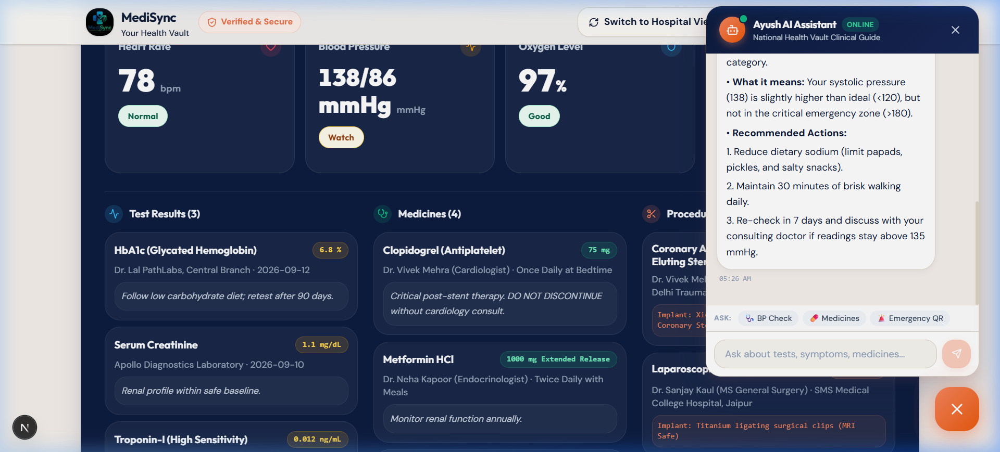
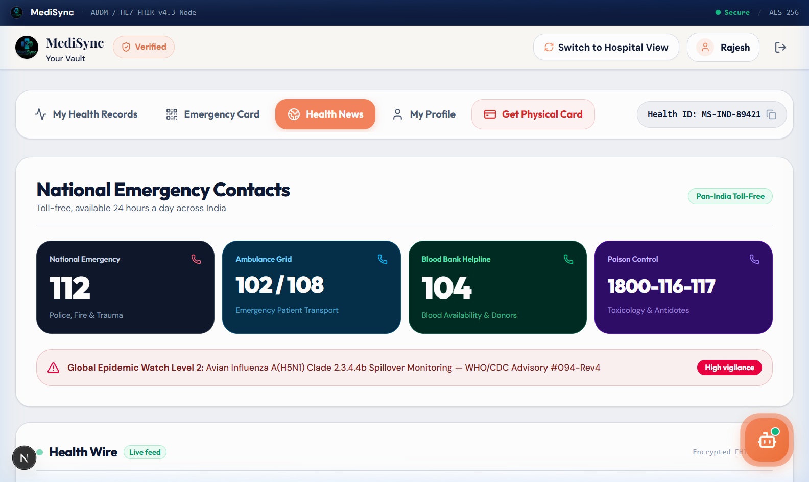
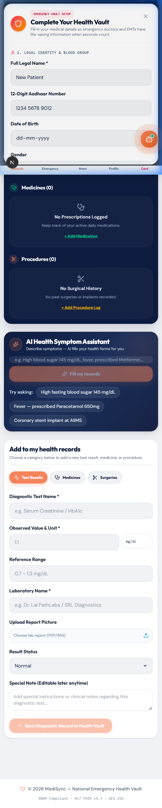
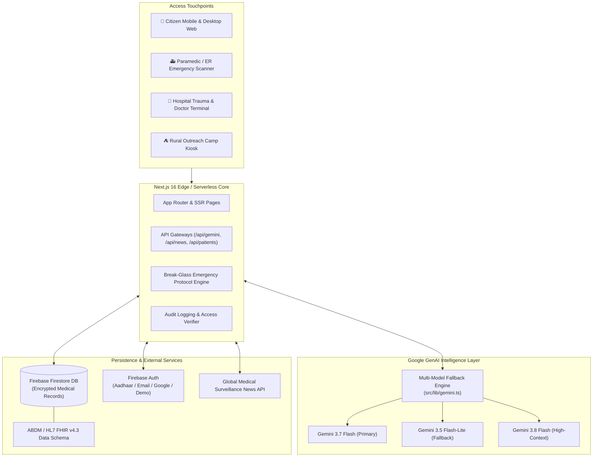
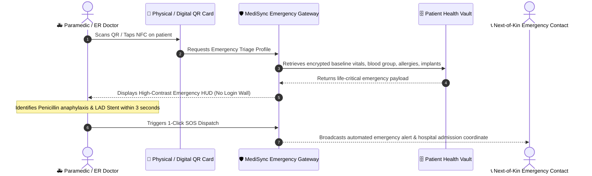

<div align="center">

  

  # 🏥 MediSync
  ### *The Next-Generation Emergency Health Vault & Clinical Intelligence Relay*

  [](https://nextjs.org/)
  [](https://react.dev/)
  [](https://ai.google.dev/)
  [](https://firebase.google.com/)
  [](https://abdm.gov.in/)
  [](LICENSE)

  <p align="center">
    <b>Empowering first responders with zero-latency emergency medical triage, bridging citizens with AI-driven health management, and uniting hospitals through an interoperable national health grid.</b>
  </p>

  <p align="center">
    <a href="https://medisync-signal4.vercel.app"><b>🚀 Live Application Demo</b></a> •
    <a href="https://github.com/NAVNEEL-jpg/medisync"><b>💻 GitHub Repository</b></a> •
    <a href="#-quick-links--judge-evaluation-fast-track"><b>Judge Evaluation Track</b></a> •
    <a href="#-the-problem--the-golden-hour-crisis"><b>Problem Statement</b></a> •
    <a href="#-interface-gallery--live-screenshots"><b>📸 Screenshots</b></a> •
    <a href="#-key-features--capabilities"><b>Features</b></a>
  </p>

  <br/>

  

</div>

---

## ⚡ Quick Links & Judge Evaluation Fast-Track

> **Welcome Hackathon Judges!** MediSync is fully pre-configured with interactive instant-login roles so you can test all patient, emergency physician, and hospital workflows in seconds without registering.

| Persona | Test Email / ID | Default Role | Key Capabilities to Test |
| :--- | :--- | :--- | :--- |
| **Rajesh Kumar Sharma** *(Citizen / Patient)* | `rajesh.sharma@gmail.com` | `PATIENT` | Dynamic Emergency QR, Gemini AI Symptom Triage, Lab Tracker, Smart Card Order with Hospital Referral |
| **Dr. Vivek Mehra** *(Trauma ER Lead)* | `dr.mehra@sms.hospital.in` | `DOCTOR` | Emergency Patient Search, Real-Time Triage Break-Glass, Manual Patient Enrollment & Document Ingestion, Unique ID/QR Generation, Enrolled Directory, Validated Hospital QR/Barcode Scanner, Lab Diagnostic Entry, 5% Partner Commission Terminal |
| **Sunita Sharma** *(ASHA Camp Facilitator)* | `asha.sunita@health.rajasthan.gov.in` | `CAMP_WORKER` | Offline Assistance Camp Kiosk, Rapid Field Registration, Aadhaar-linked Vitals Ingestion |

### 🚀 10-Second Quick Start for Judges
1. Open the deployed application (or `http://localhost:3000` locally).
2. On the **Front Welcome Screen**, simply click either **"Quick Demo: Patient View"** or **"Quick Demo: Hospital View"**.
3. Use the top navigation bar's **"Switch View"** button at any time to seamlessly toggle between the **Citizen Vault** and the **Hospital ER Terminal**.
4. Click the floating **AI Health Companion** bot icon in the bottom corner to test real-time Google Gemini clinical reasoning.

---

## 📸 Interface Gallery & Live Screenshots

<table width="100%">
  <tr>
    <td width="50%" align="center">
      <b>1. Universal Emergency Access & Registration Portal</b><br/><br/>
      
      <br/><i>Dual Citizen &amp; Hospital ER Node gateway with 1-click evaluation access.</i>
    </td>
    <td width="50%" align="center">
      <b>2. Citizen Health Chart &amp; Real-Time Vitals Grid</b><br/><br/>
      
      <br/><i>Live updates for BP, Heart Rate, SpO2, Blood Sugar, and clinical diagnostics.</i>
    </td>
  </tr>
  <tr>
    <td width="50%" align="center">
      <b>3. 24/7 Google Gemini Clinical AI Assistant</b><br/><br/>
      
      <br/><i>Natural language triage, symptom assessment, and lifestyle clinical guidance.</i>
    </td>
    <td width="50%" align="center">
      <b>4. National Emergency Hotlines &amp; Outbreak Radar</b><br/><br/>
      
      <br/><i>Direct toll-free access to 112, 108, 104, Poison Control, and live WHO alerts.</i>
    </td>
  </tr>
  <tr>
    <td colspan="2" align="center">
      <b>5. Interactive Onboarding &amp; Health Profile Setup Modal</b><br/><br/>
      
      <br/><i>Fresh, unpopulated vault for new citizens with quick-toggle chips for allergies &amp; conditions.</i>
    </td>
  </tr>
</table>

---

## 🚨 The Problem — The "Golden Hour" Crisis

In emergency medicine, the **"Golden Hour"** refers to the first 60 minutes following severe trauma or acute physiological distress (cardiac arrest, stroke, anaphylaxis). Timely, informed medical intervention during this period drastically reduces mortality:

* **150,000+ Preventable Deaths Annually in India**: Emergency responders and trauma doctors frequently treat unconscious or disoriented patients with **zero known medical history**.
* **Lethal Drug Contraindications & Allergies**: Administering Penicillin to a patient with severe anaphylactic allergies or high-dose NSAIDs during active ulcer/gastric bleeding can be fatal.
* **Hidden Surgical Implants**: Performing emergency high-field MRIs on patients with non-conditional pacemakers, older aneurysm clips, or non-compatible orthopedic implants causes irreversible internal injury.
* **Fragmented Health Data & Lost Paper Prescriptions**: Health data in India remains locked in disparate private EHR silos, paper files, or unstandardized WhatsApp PDFs.
* **Rural & Disaster Disconnect**: Primary Health Centres (PHCs) and outreach medical camps lack real-time digital sync with tertiary trauma hospitals.

---

## 💡 The MediSync Solution

**MediSync** bridges the critical gap between **Citizens**, **First Responders / Paramedics**, and **Tertiary Care Hospitals** via a unified, ABDM & HL7 FHIR-compliant national emergency health vault:

```
┌────────────────┐      Scan QR / Tap NFC      ┌──────────────────────────────┐
│ Emergency Hero │ ──────────────────────────> │ Instant Paramedic Triage HUD │
│  Wallet Card   │    Zero Login Required     │ • Blood Group & Critical Alert│
│  (NFC + QR)    │    "Break-Glass" Protocol  │ • Severe Drug Allergies       │
└────────────────┘                             │ • Stents, Implants & Pacemaker│
                                               │ • 1-Click SOS Dispatch       │
                                               └──────────────────────────────┘
```

1. **Zero-Latency Emergency Wallet Card & QR**: First responders scan the physical or digital card to instantly view life-critical data (Blood Group, Penicillin/NSAID allergies, Stents, Organ Donor status, Emergency Contacts) without needing the patient's phone password.
2. **AI-Powered Clinical Intelligence (Google Gemini 3)**:
   - **Patient Assistant**: Natural language symptom assessment, lab value interpretation, and contextual physician consultation prep.
   - **Physician Assistant**: Automatic extraction and structured population of diagnostic markers, surgical history, and drug interaction risks.
3. **Dual-Sided Unified Ecosystem**:
   - **Citizen Health Vault**: Self-sovereign health management, digital prescriptions, lab trends, and physical card delivery.
   - **Hospital / Doctor Terminal**: High-throughput Aadhaar/Phone/QR lookup, instant diagnostic and prescription authoring, verified facility QR nodes.
4. **Economically Sustainable Healthcare Network**:
   - Citizens obtain durable waterproof PVC NFC/QR Smart Cards for ₹150.
   - Partner hospitals and trauma centers receive a **5% recurring community partner commission** per card issued using their institutional referral code, creating self-funding public health infrastructure.
5. **National Grid Standards Compliance**: Built following the **Ayushman Bharat Digital Mission (ABDM)** schema and **HL7 FHIR v4.3** healthcare interoperability specifications.

---

## 🏗️ System Architecture

MediSync is designed with a modern, resilient, high-availability architecture combining Next.js 16 App Router, Firebase Cloud Services, and Google Gemini Generative AI:



### ⏱️ Emergency "Break-Glass" Triage Protocol Flow



---

## ✨ Key Features & Capabilities

### 1. 🪪 Emergency QR & NFC Smart Card
* **Zero-Login Quick Scan**: Instant triage landing screen designed for high-stress emergency environments.
* **Dynamic Patient QR & Real-Time Sync**: Every citizen and hospital-enrolled patient receives their individual QR code encoding real-time health updates, vital signs, allergies, and complete audit trails (*when it was updated and by whom*).
* **Individual Unique ID System**: Standardized clinical identifiers (e.g. `ID: MS-IND-DQ1Q1` / `#MS-IND-XXXXX`) generated across both citizen signup and hospital intake.
* **Life-Saving Critical Badges**: Blood Group, Organ Donor status, DNR (Do Not Resuscitate) flag, and primary emergency contacts.
* **MRI Safety Warnings**: Explicit flags for stents, pacemakers, and metallic orthopedic implants with conditional magnetic resonance specifications.
* **Badge Download & Print Modals**: High-contrast, printable badges with QR codes and unique IDs for patient physical wallets and bed-side hospital charts.
* **Emergency Ad & Referral Integration**: Integrated hospital referral discount code and physical card order tracker.

### 2. 🤖 Google Gemini Clinical AI Intelligence
* **Multi-Model Fallback Pipeline (`src/lib/gemini.ts`)**: Built with automatic cascading failover across `gemini-3.7-flash`, `gemini-3.5-flash-lite`, `gemini-3.8-flash`, and `gemini-3.5-flash` ensuring zero downtime during critical health queries.
* **Interactive AI Health Companion (`AiHealthBot.tsx`)**: Empathetic, conversational healthcare educator providing structured symptom breakdown, red-flag detection, and tailored physician consultation questions.
* **Smart Form Auto-Fill**: Ingests natural language symptom descriptions and automatically categorizes them into Diagnostics, Prescriptions, or Surgical logs.
* **Drug Interaction Guard**: Cross-references new medications against recorded patient allergies and existing prescription regimens.

### 3. 👤 Citizen Health Vault (`ClientDashboard.tsx`)
* **Unified Health Records**: Complete timeline of laboratory diagnostics, digital prescriptions, and surgical interventions.
* **Editable Records with Audit History**: Citizens can edit all baseline records (Diagnostics, Medications, Surgeries, Allergies) anytime while preserving previous historical records and revision stamps.
* **Dynamic Vitals Monitor**: Blood Pressure, Heart Rate, SpO2, Fasting Blood Glucose, and Body Temperature with normal/elevated/critical visual status indicators.
* **Comprehensive Onboarding & Profile Sync**: Self-serve health setup modal for new citizens capturing Aadhaar verification, emergency nominees, and known chronic conditions.
* **Download & Print Vault Summary**: 1-click formatted medical report export for physical doctor appointments.

### 4. 🏥 Hospital & Trauma Center Terminal (`HospitalDashboard.tsx`)
* **Manual Patient Enrollment Modal (`HospitalEnrollPatientModal.tsx`)**:
  - Direct hospital intake form capturing demographics (Name, Age, Gender, Blood Group), Phone, Email, 12-digit Aadhaar Number, and optional 14-digit ABHA ID (`91-XXXX-XXXX-XXXX`).
  - Baseline vitals recording (HR, BP, SpO2, Temp) and drug/food allergies.
  - Multi-file medical document upload (discharge summaries, lab reports, previous prescriptions) with file size metrics.
  - Instant generation of an individual unique ID (e.g. `ID: MS-IND-DQ1Q1`) and dynamic QR code.
* **Enrolled Hospital Patients Directory & Sub-Database**:
  - Live, searchable hospital patient registry (filter by Name, Unique ID, or Phone) persisted in local hospital sub-database.
  - Quick-view patient cards highlighting Unique ID, ABHA ID badges, document counts, blood groups, and baseline vitals.
  - Instant action buttons: **"View QR & ID"** modal (with 1-click ID copy and printable badge) and **"Open Clinical Vault"** to triage immediately.
* **Validated Hospital Barcode / QR Scanner (`HospitalQrScannerModal.tsx`)**:
  - Real-time webcam/mobile camera stream scanner, image file upload scanner, and test sample barcodes powered by `jsqr`.
  - **Strict MediSync Verification**: Strictly filters and validates QR codes—immediately flags non-registered or foreign QR codes with an alert (`⛔ Access Denied: Unregistered QR Code...`) and prevents unauthorized ingestion.
  - Valid MediSync QR codes are automatically decoded, parsed, registered into the hospital sub-database, and opened in the triage workspace.
* **Instant Multi-Identifier Lookup**: Retrieve existing patient records by MediSync Vault ID, Aadhaar Number, or Mobile Number.
* **Direct Clinical Charting**: In-ward physician entry for lab diagnostics, prescription changes, and surgical discharge logs.
* **Facility QR Node Generator**: Dedicated hospital lobby kiosk QR allowing arriving emergency walk-ins to check in instantly.
* **5% Partner Referral Monetization Hub**: Real-time revenue analytics tracking cards issued, referral discount usage, and monthly hospital commission payouts.

### 5. 🌍 Global Medical News & Outbreak Radar (`GlobalMedicalNews.tsx`)
* **Real-Time Surveillance**: Dynamic ticker and dispatches covering critical outbreaks, WHO advisories, and Class I drug safety recalls.
* **Live News API & Fallback Intelligence**: Seamless integration with live NewsAPI feeds and curated clinical intelligence alerts.

### 6. ⛺ Assistance Camp Kiosk (`AssistanceCampKiosk.tsx`)
* **Rural Health Outreach**: Lightweight interface designed for community health workers (ASHA / ANM) to conduct field health drives, register unbanked citizens, and log baseline vitals.

---

## 💻 Tech Stack & Standards

| Layer | Technology | Details / Rationale |
| :--- | :--- | :--- |
| **Frontend Framework** | **Next.js 16.3.5 (App Router)** | TurboPack optimized, React Server Components + Client interactivity |
| **UI Library** | **React 19.2.8** | Modern concurrent rendering and state primitives |
| **Styling & Theme** | **Tailwind CSS v4 & Vanilla CSS** | Custom medical-grade design tokens, dark navy & warm ivory aesthetic, accessible contrast |
| **Typography** | **Google Fonts** | Outfit (Modern Display), Playfair Display (Clinical Heritage), DM Sans (Legibility) |
| **Generative AI** | **Google GenAI SDK (`@google/genai`)** | Multi-model fallback across Gemini 3.7 / 3.5 / 3.8 Flash |
| **Backend & Database**| **Firebase Firestore & Auth** | Real-time database, role-based authorization, and instant persistence |
| **QR Code Engine** | **`qrcode.react`** | High-density SVG/Canvas vector QR code rendering |
| **QR/Barcode Scanner** | **`jsqr`** | Client-side pure JavaScript camera and image QR/barcode decoding with strict verification |
| **Icons** | **Lucide React** | Crisp, lightweight medical and clinical iconography |
| **Healthcare Standard**| **ABDM & HL7 FHIR v4.3** | National Digital Health Mission schema interoperability |
| **Security** | **AES-256 & TLS 1.3** | Field-level encryption for sensitive health identifiers |

---

## 🧪 Step-by-Step Judge Walkthrough

Follow this 3-minute walkthrough to experience MediSync's complete end-to-end workflow:

### Step 1: Citizen Emergency Card & Vault Experience
1. Navigate to the landing page and click **"Quick Demo: Patient View"**.
2. You will be logged in as **Rajesh Kumar Sharma** (Pre-populated with cardiovascular stent history, penicillin allergy, and hypertension vitals).
3. **Tab 1 ("My Health Records")**:
   - Scroll through Diagnostics, Prescriptions, and Surgical Logs.
   - In the **AI Symptoms Assistant** box, enter: *"I have had mild chest tightness and lightheadedness since yesterday"* and click **"Analyze with Gemini AI"**.
   - Notice how Gemini extracts clinical triage parameters and automatically populates the appropriate medical record form!
4. **Tab 2 ("Emergency Card")**:
   - View the high-contrast **Digital Emergency Wallet Card**.
   - Inspect the **QR Code Node** designed for first responders.
   - Click **"Print Emergency Card"** or **"Download Card"** to test export functionality.
5. **Tab 5 ("Get Physical Card")**:
   - Notice the physical Smart NFC/QR card ordering portal (₹150).
   - In the Hospital Referral field, enter `SMS-JAIPUR-42` and click **"Apply Code"** to verify the 5% partner discount!

### Step 2: Test the Floating Gemini Health Companion
1. Click the circular **AI Health Assistant icon** in the bottom-right corner.
2. Ask a medical question, for example: *"Can I take Ibuprofen if I am already on Clopidogrel and have asthma?"*
3. Watch MediSync AI leverage the patient's active medication and allergy context to deliver a clear, structured warning about NSAID-antiplatelet bleeding risks.

### Step 3: Switch to Hospital & ER Trauma Terminal
1. In the top navigation bar, click **"Switch to Hospital View"**.
2. You are now logged in as **Dr. Vivek Mehra (ER Trauma Lead, SMS Medical College Hospital)**.
3. **Manual Patient Enrollment (`+ Enroll New Patient`)**:
   - Click the blue **"+ Enroll New Patient"** button in the header.
   - Enter Demographics (Name, Age, Gender, Blood Group), Contact Phone, Email, 12-digit Aadhaar Number, and optional 14-digit ABHA ID (`91-XXXX-XXXX-XXXX`).
   - Enter baseline vitals (HR, BP, SpO2, Temp) and allergies (e.g. `Sulfa drugs, Latex`).
   - Attach medical documents (discharge summary, lab test results) and notice the file size tracker and attachment preview.
   - Click **"Register & Generate MediSync ID"** — observe the generated unique ID (e.g. `ID: MS-IND-DQ1Q1`) and dynamic QR code with immediate badge print/download options!
4. **Strict Barcode / QR Scanner (`📷 Scan Patient Barcode/QR`)**:
   - Click **"Scan Patient Barcode/QR"** in the top action bar.
   - Test scanning with your camera, uploading a QR image, or clicking **"Test Registered Patient QR"**.
   - Notice the strict security gate: scanning non-registered/foreign barcodes prompts a prominent alert (`⛔ Access Denied: Unregistered QR Code...`), while scanning valid MediSync codes decodes all vitals, adds the patient to the hospital directory, and opens their chart immediately!
5. **Enrolled Hospital Patients Directory**:
   - Scroll down to the **"Enrolled Hospital Patients Directory"** on the triage screen.
   - Search patients in real-time by Name, Unique ID (`#MS-IND-...`), or Phone number.
   - Click **"View QR & ID"** on any patient card to inspect and copy their unique ID or display/print their QR badge.
   - Click **"Open Clinical Vault"** to instantly load their clinical chart into the physician workspace.
6. **Patient Search & Break-Glass Lookup**:
   - In the search bar, enter `9876543210` or `MS-IND-89421` and click **"Search Vault"**.
   - Rajesh's complete clinical record instantly loads into the trauma terminal.
7. **Clinical Entry**:
   - Select **"Add Diagnostic Report"**, enter `Troponin I`, value `0.04`, unit `ng/mL`, status `NORMAL`, and submit.
   - The diagnostic timeline updates in real-time.
8. **Partner Commission Tab**:
   - Click **"5% Partner Commission"** in the sidebar.
   - View the hospital's unique referral code (`SMS-JAIPUR-42`), commission ledger, and monthly payout tracker.

---

## 🛠️ Local Development & Setup

### Prerequisites
* **Node.js**: `v20.x` or higher (Node 22 LTS recommended)
* **npm**: `v10.x` or higher
* **Git** installed on your system

### 1. Clone the Repository
```bash
git clone https://github.com/NAVNEEL-jpg/medisync.git
cd medisync
```

### 2. Install Dependencies
```bash
npm install
```

### 3. Environment Configuration
Create a `.env.local` file in the root directory (you can copy `.env.example`):
```bash
cp .env.example .env.local
```

Populate the required environment keys:
```env
# Google Gemini API Key (Get free key at: https://aistudio.google.com/)
GEMINI_API_KEY=your_gemini_api_key_here

# Optional: NewsAPI Key for Live Global Medical Intelligence (https://newsapi.org/)
NEWS_API_KEY=your_news_api_key_here

# Optional: Firebase Configuration (The app runs in offline demo mode if omitted)
NEXT_PUBLIC_FIREBASE_API_KEY=your_firebase_api_key
NEXT_PUBLIC_FIREBASE_AUTH_DOMAIN=your-app.firebaseapp.com
NEXT_PUBLIC_FIREBASE_PROJECT_ID=your-project-id
NEXT_PUBLIC_FIREBASE_STORAGE_BUCKET=your-app.appspot.com
NEXT_PUBLIC_FIREBASE_MESSAGING_SENDER_ID=your-messaging-sender-id
NEXT_PUBLIC_FIREBASE_APP_ID=your-app-id
```

> **Note**: If Firebase or NewsAPI keys are not provided, MediSync gracefully defaults to its built-in clinical mock database and verified medical news feed, allowing offline testing and evaluation.

### 4. Run Development Server
```bash
npm run dev
```
Open [http://localhost:3000](http://localhost:3000) in your browser.

### 5. Production Build Verification
To ensure all TypeScript types and Turbopack routes compile cleanly:
```bash
npm run build
npm run start
```

---

## 📂 Project Directory Structure

```
medisync/
├── .github/                       # GitHub issue & PR templates
│   ├── ISSUE_TEMPLATE/
│   │   ├── bug_report.md
│   │   └── feature_request.md
│   └── PULL_REQUEST_TEMPLATE.md
├── public/                        # Static assets & brand media
│   ├── emergency_wallet_card_ad.jpg  # Physical Smart Card promotional banner
│   ├── hero_medical_bg.jpg           # Clinical hero background imagery
│   ├── login-hero.jpg                # Authentication showcase artwork
│   ├── medisync-logo.jpg             # High-resolution brand logo
│   └── favicon.ico
├── src/
│   ├── app/                       # Next.js 16 App Router
│   │   ├── api/                   # Serverless Backend API Routes
│   │   │   ├── gemini/            # Google Gemini AI routes (analyze, chat, interactions)
│   │   │   ├── news/              # Real-time medical news API
│   │   │   └── patients/          # Patient lookup & record update endpoints
│   │   ├── globals.css            # Medical design tokens, animations & utility classes
│   │   ├── layout.tsx             # Root layout with fonts (Playfair, Outfit, DM Sans)
│   │   └── page.tsx               # Dynamic role-based root router
│   ├── components/                # Modular React 19 UI Components
│   │   ├── ui/                    # Reusable atom components (Card, Button, Badge, TabBar)
│   │   ├── AiHealthBot.tsx        # Floating Google Gemini 24/7 Health Assistant
│   │   ├── AssistanceCampKiosk.tsx# Rural health camp field registration interface
│   │   ├── ClientDashboard.tsx    # Citizen Health Vault (5 sub-pages)
│   │   ├── EmergencyLookup.tsx    # Paramedic high-speed patient lookup
│   │   ├── EmergencyPatientView.tsx# Triage HUD view for first responders
│   │   ├── EmergencyWalletCard.tsx# Printable & interactive emergency card
│   │   ├── FrontAuthPage.tsx      # Landing page, role switch & 1-click demo entry
│   │   ├── GlobalMedicalNews.tsx  # Live medical news & outbreak radar
│   │   ├── HospitalDashboard.tsx  # Doctor & Trauma Center terminal (5 sub-pages + Enrolled Directory)
│   │   ├── HospitalEnrollPatientModal.tsx # Multi-step manual admission, document upload & unique ID generator
│   │   ├── HospitalQrScannerModal.tsx # Validated hospital QR/barcode scanner with strict security gate
│   │   ├── LiveNewsMarquee.tsx    # Breaking emergency health alert ticker
│   │   ├── MediSyncLogo.tsx       # Vectorized brand identity component
│   │   ├── PatientQRCode.tsx      # High-density patient emergency QR renderer
│   │   └── PatientQrPreviewModal.tsx # Patient unique ID & printable QR badge modal
│   ├── context/
│   │   └── AuthContext.tsx        # Multi-role authentication & demo credentials context
│   └── lib/
│       ├── firebase.ts            # Firebase client initialization
│       ├── firestoreService.ts    # Database abstraction layer
│       ├── gemini.ts              # Gemini multi-model fallback & prompt pipelines
│       ├── mockDatabase.ts        # Comprehensive clinical seed profiles
│       ├── newsData.ts            # Clinical dispatches & outbreak metrics
│       └── types.ts               # Core TypeScript interfaces (HL7 FHIR compliant)
├── ARCHITECTURE.md                # In-depth architectural & technical specification
├── CONTRIBUTING.md                # Open source contribution guidelines
├── LICENSE                        # MIT License
├── README.md                      # Primary project documentation
└── package.json                   # Dependencies and build scripts
```

---

## 🔒 Security, Privacy & Compliance

Healthcare applications demand uncompromising standards of privacy and security:

1. **Role-Based Access Control (RBAC)**: Strict segregation of privileges between Citizens, Clinicians, Paramedics, and Camp Volunteers.
2. **Emergency Break-Glass Protocol**: Immediate access is strictly constrained to life-critical emergency fields (blood type, allergies, implants, emergency contacts). Sensitive past records, diagnostic notes, and full history remain gated.
3. **Immutable Access Audit Logs**: Every emergency triage scan or clinical chart edit generates an immutable audit record with timestamp, accessor license number, and facility geolocation.
4. **Data Sovereignty & Encryption**: High-grade AES-256 encryption at rest and TLS 1.3 in transit, engineered to comply with India's Digital Personal Data Protection (DPDP) Act and ABDM consent guidelines.

---

## 🗺️ Roadmap & Future Vision

- [x] **Phase 1: Emergency QR Vault & Clinical Triage Core** *(Completed)*
- [x] **Phase 2: Google Gemini Clinical AI Assistant with Multi-Model Fallback** *(Completed)*
- [x] **Phase 3: Hospital Partner Terminal & 5% Referral Commission Engine** *(Completed)*
- [ ] **Phase 4: Official ABDM Milestone M1, M2, M3 Sandbox Integration**: Direct linkage with government-issued ABHA (Ayushman Bharat Health Account) IDs.
- [ ] **Phase 5: BLE Ambulance Beacon Integration**: Bluetooth Low Energy beacons in ambulances automatically retrieving incoming patient vitals within 50-meter radius.
- [ ] **Phase 6: Offline PWA & Mesh Sync**: Peer-to-peer Wi-Fi Direct sync for disaster relief zones and remote defense medical camps.

---

## 👥 The MediSync Team & Hackathon Submission

* **Team Name**: **Signal4**
* **Track**: Web Development (HEALTHCARE)
* **Project**: MediSync — Unified Emergency Health Vault & Instant Trauma Relay
* **Live Deployment**: [https://medisync-signal4.vercel.app](https://medisync-signal4.vercel.app)
* **Repository**: [https://github.com/NAVNEEL-jpg/medisync](https://github.com/NAVNEEL-jpg/medisync)
* **License**: [MIT](LICENSE)

### Team Members
1. **Debanjan Sen** *(Team Leader)*
2. **Navneel Dutta**
3. **Swastik Mitra**
4. **Rohan Kundu**

*Created with ❤️ by Team Signal4 for the Hackathon to save lives in the Golden Hour.*
